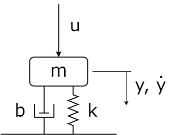
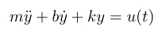
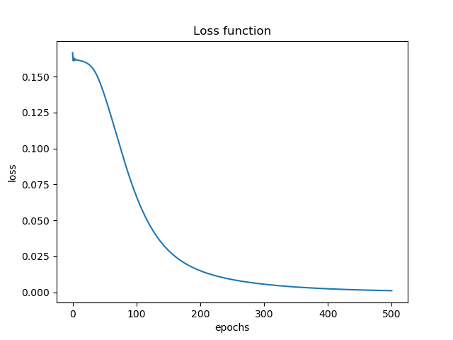
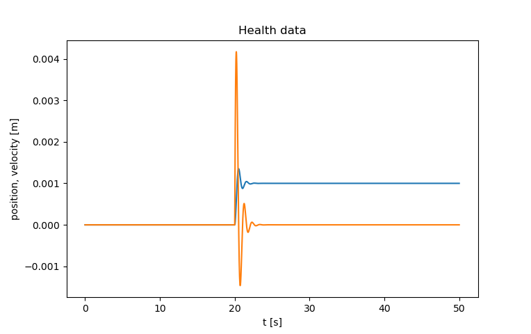
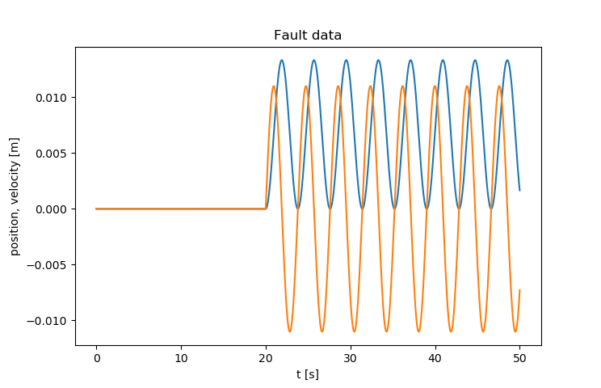

# RNF projekt: Detekce chyby

#### Zpracovali: 
- Artyom Voronin
- Martin Havelka
- Tomáš Kopčil
- Jan Bolcek
- Jan Hrůzek

## Instalace 
- install dependencies
```shell
pip install -r requirements.txt
```
- install [PyTorch](https://pytorch.org/get-started/locally/)

## Model a generování dat
Jako model byl použit jednoduchý mechanický oscilátor skládající se z tělesa, pružiny a tlumiče. Parametry tohoto
systému jsou tedy hmostnost *m*, tuhost pružiny *k* a tlumení *b* (podle přiloženého obrázku).



Model je popsán differenciální rovnicí:



Oscilátor byl buzen signálem *u(t)* o průběhu "step" a sinus a měrena byla výchylka a rychlost tělesa.

#### Generování korektních a chybných dat
Pro zmíněný model bylo vygenerováno sto různých kombinací parametrů a pro ně naměřena odezva. Tato data byla označena
jako korektní.
Jako chybná byla uvažována situace, kdy se v praxi "utrhne" pružina nebo tlumič, tedy *k = 0* nebo *b = 0*. Dále také,
pokud je poměrný útlum soustavy větší, nebo roven jedné, tedy soustava je přetlumená a nedochází ke kmitání. 

## Statistické zpracování dat
Pro každý balík naměřených dat byla zpracována statistická analýza. Určeny byly následující statistické parametry:
- minimum
- maximum
- aritmetický průměr
- medián
- standardní odchylka
- rozptyl
- RMS
- Fourierova transformace pomocí FFT algoritmu a následně vybrány 3 nejvíce dominantní frekvence.

Tyto parametry byly zabaleny společně s označením (label), zda se jedná o chybná, nebo korektní data, a následně
použita jako dataset pro neuronovou síť.
Pro práci s daty byla využity struktury knihovny *numpy*, které je následně Pytorch schopen zkonvertovat do svého
formátu.
## Dataset
Ze statisticky zpracovaných dat byl vytvořen dataset, který odpovídá vstupům neuronové sítě. Jedná se o tensor,  
který obsahuje hodnoty features (statistické parametry) a labels (označení správných a chybných dat, 1/0). Následně byl
dataset rozdělen na trénovací a validační data v poměru 80% ku 20%. Takto rozdělený dataset byl dále použit v neuronové
síti.

## Neuronová síť
Pro vytvoření neuronové sítě byl použit nástroj PyTorch. Byl vytvořen model s jednou vstupní, skrytou a výstupní
vrstvou.  

  #### Velikost vsrtev:
      Vstupní vrstva: 20
      Skrytá vrstva: 16
      Výstupní vrstva: 1

  #### Parametry sítě:
      Aktivační funkce: sigmoid
      Optimizator: Adam 
      Loss function: MSELoss 
      learning rate: 0,05 
      počet epoch: 500 
      velikost batch: 5

Trénování neuronové sítě tedy probíhalo v závislosti na velikosti batch a na počtu epoch. Výsledky trénování jsou
zobrazeny v následující části. 

## Výsledky




```shell
[TEST] CASE 1 "Health data" : label=1.0 net_output=0.9970
[TEST] CASE 2 "Fault data " : label=0.0 net_output=0.0000
```
Na modelu byla vygenerována korektní i chybná data pro verifikaci funkčnosti neuronové sítě. Tato data jsou zobrazena
na následujících obrázcích.
První obrázek zobrazuje výchylku a rychlost tělesa v čase pro korektní, plně funkční, model. Jak
jde vidět, rychlost a výchylka jsou vůči sobě fázově posunuty a poměrně rychle se ustálí – jedná se o odezvu na
skok, na který tlumená soustava reaguje postupným ustálením.

Druhý obrázek zobrazuje situaci pro chybný model, konkrétně případ, kdy se "utrhnul" tlumič a tlumení soustavy je tedy
nulové. V tomto případě proto nedochází k ustálení a soustava kmitá dále se stejnou amplitudou.


## Závěr
Pro detekci chyb pomocí neuronové sítě byl vytvořen model po generování dat. Na tomto modelu byla vygenerována data
označená jako korektní i chybná. Tato data byla statisticky zpracována pro neuronovou síť, která jimi byla následně
natrénována.  
Neuronová síť byla vytvořena pomocí nástroje PyTorch, která obsahovala 20 neuronů ve vstupní vrstvě, 16 neuronů ve skryté
vrstvě a 1 neuron ve výstupní vrstvě.
Byla také vygenerována verifikační data pro ověření funkčnosti neuronové sítě.

## Zdroje
- [wiki](https://en.wikipedia.org/wiki/Fault_detection_and_isolation)
- [PyTorch: nn](https://pytorch.org/tutorials/beginner/pytorch_with_examples.html#pytorch-nn)
- [link](https://www.sciencedirect.com/science/article/pii/S1876610218304831)
- [kaggle](https://www.kaggle.com/c/vsb-power-line-fault-detection/notebooks)
- [FDI](https://www.researchgate.net/publication/221412815_Fault_detection_methods_A_literature_survey/)
